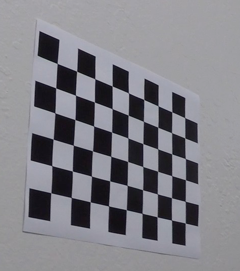
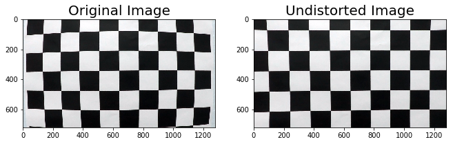
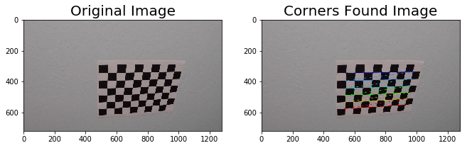
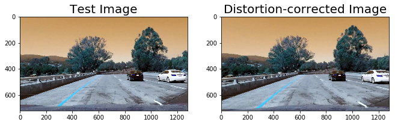
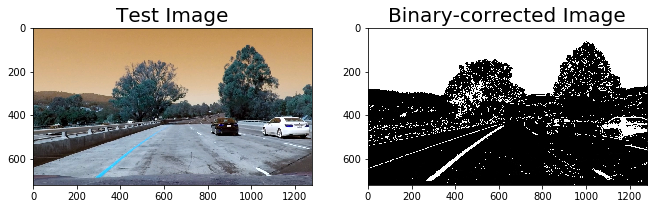
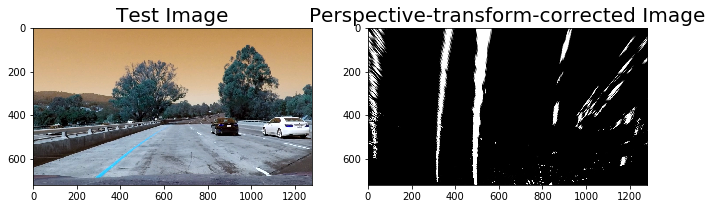
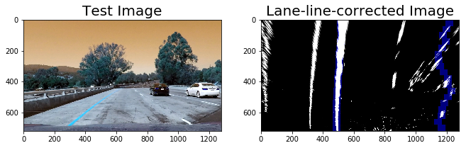
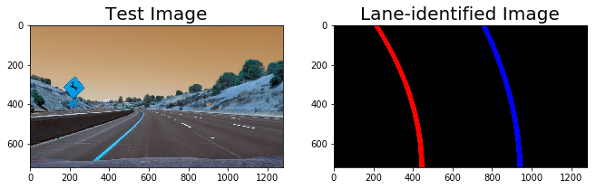
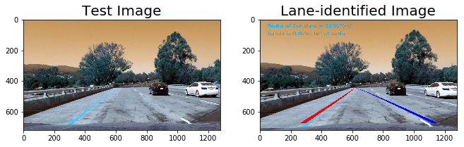

## Advanced Lane Finding Project

In this project, my goal is to write a software pipeline to identify the lane boundaries in a video.


The goals / steps of this project are the following:

+ Compute the camera calibration matrix and distortion coefficients given a set of chessboard images.
+ Apply a distortion correction to raw images.
+ Use color transforms, gradients, etc., to create a thresholded binary image.
+ Apply a perspective transform to rectify binary image ("birds-eye view").
+ Detect lane pixels and fit to find the lane boundary.
+ Determine the curvature of the lane and vehicle position with respect to center.
+ Warp the detected lane boundaries back onto the original image.
+ Output visual display of the lane boundaries and numerical estimation of lane curvature and vehicle position.

The images for camera calibration are stored in the folder called camera_cal. The images in test_images are for testing the pipeline on single frames.

## Camera Calibration

### 1. Briefly state how you computed the camera matrix and distortion coefficients. Provide an example of a distortion corrected calibration image.

In order to begin this project, I must first calibrate the camera. Udacity has provided a series of test images from the `camera_cal` directory. Each image is a picture of a chessboard pattern taken from an angle, like the following...


 

The two main OpenCV functions used for image calibration are `findChessboardCorners` and `calibrateCamera`. I start by preparing "object points", which will be the (x, y, z) coordinates of the chessboard corners in the world. Here I am assuming the chessboard is fixed on the (x, y) plane at z=0, such that the object points are the same for each calibration image. 

The initial repository contained several images of a chessboard taken from different angles with the same camera. This initial set of images is the input to `findChessboardCorners` which outputs object points and image coordinates corresponding to the location of the corners of the internal chessboard. `objp` is just a replicated array of coordinates, and `objpoints` will be appended with a copy of it every time I successfully detect all chessboard corners in a test image.  `imgpoints` will be appended with the (x, y) pixel position of each of the corners in the image plane with each successful chessboard detection. These are appended to the `imgpoints` and `objpoints` arrays respectively. 

These arrays are fed into the `calibrateCamera` function which returns camera calibration and distortion coefficients. As a result, the OpenCV `undistort` function undo's the effects of distortion on any image produced by the same camera as see below. Please also note the corners drawn onto the chessboard images using `drawChessboardCorners` function below.







### 1. Provide an example of a distortion-corrected image.
After I calibrated the camera in the previous step above, I can apply the camera matrix and distortion coefficients to correct any distortion in the input images. OpenCV provides a `undistor` function to help with this. 
Notice the distortion-corrected image contains a partial image for the white vehicle, corrections are more visible on the image edges.




### 2. Describe how (and identify where in your code) you used color transforms, gradients or other methods to create a thresholded binary image. Provide an example of a binary image result.
Thresholding is the process which tries to take the undistorted image and mask out the pixels which are part of the lanes from those which aren't.
Here's the code which implements the thresholded binary image logic:

```python
    preprocessImage = np.zeros_like(img[:,:,0])
    gradx = abs_sobel_thresh(img, orient="x", thresh=(12,255) )
    grady = abs_sobel_thresh(img, orient="y", thresh=(25,255) )
    c_binary = color_threshold(img, sthresh=(100,255), vthresh=(50,255))
    preprocessImage[((gradx == 1) & (grady == 1) | (c_binary == 1) )] = 255
```




### 3. Describe how (and identify where in your code) you performed a perspective transform and provide an example of a transformed image.
Once I have the binary threshold image from previous step, I can apply a perspective transform to generate a top down image of the road using the `warpPerspective` function from OpenCV. 

```python
    # work on defining perspective transformation area
    img_size = (img.shape[1],img.shape[0])
    bot_width = .76 # percent of bottom trapizoid height
    mid_width = .1 # percent of middle trapizoid height
    height_pct = .63 # percent for trapizoid height
    bottom_trim = .935 # percent from top to bottom to avoid car hood 
    src = np.float32([[img.shape[1]*(.5-mid_width/2),img.shape[0]*height_pct],[img.shape[1]*(.5+mid_width/2),img.shape[0]*height_pct],[img.shape[1]*(.5+bot_width/2),img.shape[0]*bottom_trim],[img.shape[1]*(.5-bot_width/2),img.shape[0]*bottom_trim]])
    offset = img_size[0]*.33
    dst = np.float32([[offset, 0], [img_size[0]-offset, 0],[img_size[0]-offset, img_size[1]], [offset ,img_size[1]]])
    
    # perform the transform
    M = cv2.getPerspectiveTransform(src,dst)
    Minv = cv2.getPerspectiveTransform(dst,src)
    warped = cv2.warpPerspective(preprocessImage,M,img_size,flags=cv2.INTER_LINEAR)
```




### 4. Describe how (and identify where in your code) you identified lane-line pixels and fit their positions with a polynomial?
This step in the pipeline will extract the lane pixels for the left and right lanes from the perspective image above.

```python

    # Set up the overall class to do all the tracking
    curve_centers = Tracker(Mymargin = 25, Mycenter_dis = .275*1280, Mywindow_width = 25, Mywindow_height = 40, Mypadding = 25, Myslide_res = 5, Myframe_ps = 1, My_ym = 10/720, My_xm = 4/384, Mysmooth_factor=15)
    # find the best line centers based on the binary pixel of interest input
    window_centroids = curve_centers.find_window_centroids(warped)
    
    # need these parameters to draw the graphic overlay illustraing the window convolution matching
    window_width = curve_centers.window_width 
    window_height = curve_centers.window_height
    # points used for graphic overlay 
    l_points = np.zeros_like(warped)
    r_points = np.zeros_like(warped)

    # points used to find the left and right lanes
    rightx = []
    leftx = []
    
    for level in range(0,len(window_centroids)):
        l_mask = window_mask(window_width,window_height,warped,window_centroids[level][0],level)
        r_mask = window_mask(window_width,window_height,warped,window_centroids[level][1],level)

        # fill in graphic points here if pixels fit inside the specificed window from l/r mask
        l_points[(l_points == 255) | ((l_mask == 1) ) ] = 255
        r_points[(r_points == 255) | ((r_mask == 1) ) ] = 255

    # drawing the graphic overlay to represents the results found for tracking window centers
    template = np.array(r_points+l_points,np.uint8)
    zero_channel = np.zeros_like(template)
    template = np.array(cv2.merge((zero_channel,zero_channel,template)),np.uint8)
    warpage = np.array(cv2.merge((warped,warped,warped)),np.uint8)
    result = cv2.addWeighted(warpage, 1, template, 0.5, 0.0)
```




### 5. Describe how (and identify where in your code) you calculated the radius of curvature of the lane and the position of the vehicle with respect to center.

Once I have the left and right lanes from the previous step, I use the Numpy `polyfit` function to fit a polynomial to each lane as well as calculating the radius of the curvature for each lane. 

```python
 
    # fit the lane boundaries to the left,right center positions found
    yvals = range(0,warped.shape[0])
    res_yvals = np.arange(warped.shape[0]-(window_height/2),0,-window_height)

    left_fit = np.polyfit(res_yvals, leftx, 2)
    left_fitx = left_fit[0]*yvals*yvals + left_fit[1]*yvals + left_fit[2]
    left_fitx = np.array(left_fitx,np.int32)

    right_fit = np.polyfit(res_yvals, rightx, 2)
    right_fitx = right_fit[0]*yvals*yvals + right_fit[1]*yvals + right_fit[2]
    right_fitx = np.array(right_fitx,np.int32)

    # used to format everything so its ready for cv2 draw functions
    left_lane = np.array(list(zip(np.concatenate((left_fitx-window_width/2,left_fitx[::-1]+window_width/2), axis=0),np.concatenate((yvals,yvals[::-1]),axis=0))),np.int32)
    right_lane = np.array(list(zip(np.concatenate((right_fitx-window_width/2,right_fitx[::-1]+window_width/2), axis=0),np.concatenate((yvals,yvals[::-1]),axis=0))),np.int32)
    inner_lane = np.array(list(zip(np.concatenate((left_fitx+window_width/2,right_fitx[::-1]-window_width/2), axis=0),np.concatenate((yvals,yvals[::-1]),axis=0))),np.int32)

    # draw lane lines, middle curve, road background on two different blank overlays
    road = np.zeros_like(template)
    road_bkg = np.zeros_like(template)
    cv2.fillPoly(road,[left_lane],color=[255, 0, 0])
    cv2.fillPoly(road,[right_lane],color=[0, 0, 255])  
   
```




### 6. Provide an example image of your result plotted back down onto the road such that the lane area is identified clearly.
The final step is to draw the detected lanes on to the undistorted images. I need to do an inverse perspective mapping since the lanes had been detected in the perspective view. In addition, I also calculate the offset of the car on the road.

```python

    # draw lane lines, middle curve, road background on two different blank overlays
    road = np.zeros_like(template)
    road_bkg = np.zeros_like(template)
    cv2.fillPoly(road,[left_lane],color=[255, 0, 0])
    cv2.fillPoly(road,[right_lane],color=[0, 0, 255])
    cv2.fillPoly(road_bkg,[left_lane],color=[255, 255, 255])
    cv2.fillPoly(road_bkg,[right_lane],color=[255, 255, 255])    
    
    # after done drawing all the marking effects, warp back image to its orginal perspective.
    # Note for the two different overlays, just seperating road_warped and road_warped_bkg to get two different alpha values, its just for astetics...
    road_warped = cv2.warpPerspective(road,Minv,img_size,flags=cv2.INTER_LINEAR)
    road_warped_bkg = cv2.warpPerspective(road_bkg,Minv,img_size,flags=cv2.INTER_LINEAR)    
   
    base = cv2.addWeighted(img, 1.0, road_warped_bkg, -1.0, 0.0)
    result = cv2.addWeighted(base, 1.0, road_warped, 1.0, 0.0)
    
    # calcuate the middle line curvature
    ym_per_pix = curve_centers.ym_per_pix # meters per pixel in y dimension
    xm_per_pix = curve_centers.xm_per_pix # meteres per pixel in x dimension
    
    curve_fit_cr = np.polyfit(np.array(res_yvals,np.float32)*ym_per_pix, np.array(leftx,np.float32)*xm_per_pix, 2)
    curverad = ((1 + (2*curve_fit_cr[0]*yvals[1]*ym_per_pix + curve_fit_cr[1])**2)**1.5) /np.absolute(2*curve_fit_cr[0])

    # calculate the offset of the car on the road
    camera_center = (left_fitx[-1] + right_fitx[-1])/2
    center_diff = (camera_center-warped.shape[1]/2)*xm_per_pix
    side_pos = 'left'
    if center_diff <= 0:
        side_pos = 'right'
        
    # draw the text showing curvature, offset, and speed
    cv2.putText(result,'Radius of Curvature = '+str(round(curverad,3))+'(m)',(50,50) , cv2.FONT_HERSHEY_SIMPLEX, 1,(5, 176, 249),2)
    cv2.putText(result,'Vehicle is '+str(abs(round(center_diff,3)))+'m '+side_pos+' of center',(50,100) , cv2.FONT_HERSHEY_SIMPLEX, 1,(5, 176, 249),2)

```





## Video Pipeline


```python
def process_image(img):
	...

video_output = Output_video
clip1 = VideoFileClip(Input_video)
video_clip = clip1.fl_image(process_image) #NOTE: this function expects color images!!
video_clip.write_videofile(video_output, audio=False)
```


Here's a [link](https://youtu.be/2TgMffSzuMU) to the video


```python
from IPython.display import HTML
HTML("""
<video width="960" height="540" controls>
  <source src="{0}">
</video>
""".format(video_output))
```

<video width="960" height="540" controls>
  <source src="output1_tracked.mp4">
</video>


## Discussion:
### Briefly discuss any problems / issues you faced in your implementation of this project. Where will your pipeline likely fail? What could you do to make it more robust?


This project required alot of experimentation for the various parameters (see above) inorder to detect the lane more robustly. 

One of the limitations of the current pipeline is it's inability to deal well with changing light conditions. For example, the second and third challenge videos contain different brightless levels for the lane (trees, different color of concrete etc) which make it challenging for the algorithm. Additionally, real life poses challenges such as rain, snow, and shadows from buildings which impact the amount of shade in the image. More advanced filtering and brightness equalization techniques have to be considered for better detection.

Another improvement I can make in the future is to keep track of the last several detections of the lane lines and curvatures which can then be used to treat new detections. This can be implemented using a class for Line to track all important parameters measured between frames.

